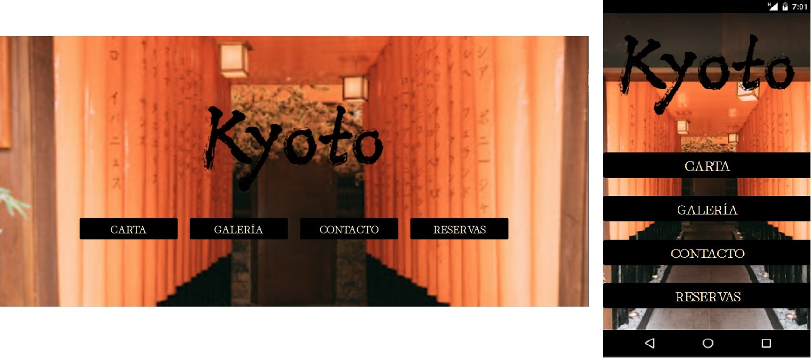

*First in Spanish then in* [*English*](https://github.com/ansualo/proyecto1-consola#kioto-restaurant)

---

# Restaurante Kioto

### Tabla de contenidos 

- ¿Qué es?
- Desarrollo y tecnologías usadas
- ¿Qué incluye?
- Errores conocidos 
- Créditos 

 
*Puedes ver el proyecto* [*aquí.*](https://ansualo.github.io/proyecto2-restauranteKioto/)

   

---

### ¿Qué es? 

Se trata de la web de un restaurante japonés, creada en un ámbito educativo para GeeksHubs Academy. El requisito principal del proyecto era la utilización de Bootstrap para que fuese 100% responsive.

Me he inspirado tanto en el restaurante Voltereta Kioto como en el restaurante ASOKO. El primero ha inspirado la estética del local, usando fotos de la zona decorada en el pasado de Japón y de su terraza. El segundo ha inspirado la carta, tanto de comida como de bebida, eligiendo algunas fotos de su menu.

---
### Desarrollo y tecnologías usadas

La web se ha creado usando HTML5, Bootstrap y CSS3. Este último se ha intentado utilizar lo menos posible dando prioridad a las características de Bootstrap.

Para conseguir que la web fuese responsive se ha construido con el sistema de filas y columnas, dando diferentes tamaños y propiedades para ajustarse a diferentes anchos de pantalla.

Tambien se han utilizado algunos componentes como tarjetas (en la Carta de comida), formularios (tanto en Contacto como Reservas) y la navbar. Ejemplos de la utilización de Bootstrap:

---
### ¿Que incluye? 

Al lanzar la web se observa la página de inicio con el logo del restaurante y las diferentes páginas disponibles.

En la sección Carta podemos ver el menu de comida y, a través del desplegable de la navbar, podemos acceder a la carta de bebidas.

En la Galeria podemos ver fotos tanto del restaurante como de su terraza exterior.

En la sección de Contacto nos encontramos con un formulario, además del horario y dirección del restaurante.

Por último, en la sección de reservas nos encontramos otro formulario y, al clicar en "Continuar", veremos una página de confirmación de la reserva.

---
### Errores conocidos

Tanto la página de contacto como la de reservas incluyen formularios ficticios, la información introducida no se guarda.

---
### Créditos y Copyright 

Este proyecto ha sido realizado por mí, Andrea Suárez, en mayo de 2023.

Las imágenes se han utilizado en un entorno educativo. Pertencen tanto a Voltereta Kioto como al restaurante ASOKO.

---
---
---

# Kyoto Restaurant

### Table of contents 

- What is it?
- Development and technologies used
- What does it include?
- Known errors 
- Credits 

 
*You can see the project* [*here.*](https://ansualo.github.io/proyecto2-restauranteKioto/)

   

---

### What is it? 

This is a website for a Japanese restaurant, created in an educational environment for GeeksHubs Academy. The main requirement of the project was the use of Bootstrap to make it 100% responsive.

I was inspired by both Voltereta Kioto restaurant and ASOKO restaurant. The first one has inspired the aesthetics of the restaurant, using photos of the area decorated in Japan's past and its outdoor terrace. The second one has inspired the menu, both food and drinks, choosing some photos from their menu.

---
### Development and technologies used

The website has been created using HTML5, Bootstrap and CSS3. The latter has been used as little as possible giving priority to Bootstrap features.

To make the website responsive it has been built with the row and column system, giving different sizes and properties to adjust to different screen widths.

I have also used some components such as cards (in the food menu), forms (both Contact and Reservations) and the navbar. Examples of the use of Bootstrap:

---
### What does it include? 

When we launch the website we can see the home page with the logo of the restaurant and the different pages available.

In the Menu section we can see the food menu and, through the navbar dropdown, we can access the drinks menu.

In the Gallery we can see photos of both the restaurant and its outdoor terrace.

In the Contact section we can find a form, as well as the opening hours and address of the restaurant.

Finally, in the reservation section we find another form and, when we click on "Continue", we will see a reservation confirmation page.

---
### Known errors

Both the contact page and the booking page include fictitious forms, the information entered is not saved.

---
### Credits and Copyright 

This project has been made by me, Andrea Suárez, in May 2023.

The images have been used in an educational environment. They belong to both Voltereta Kioto and ASOKO restaurant.